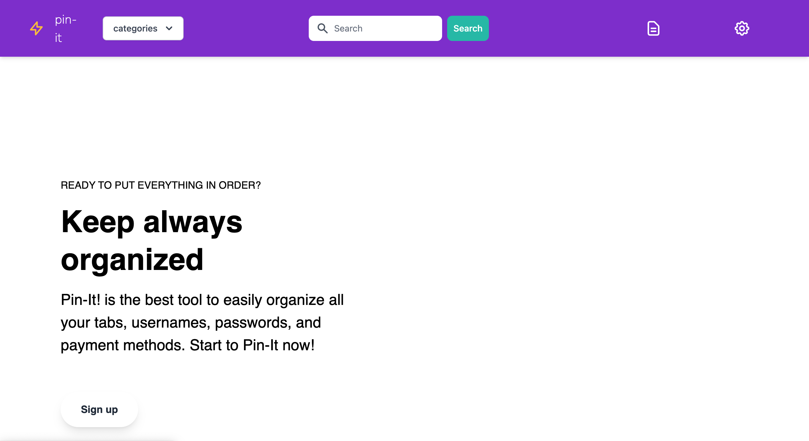
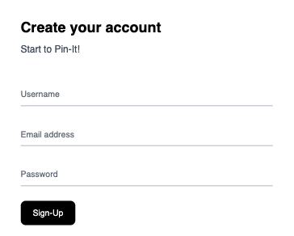
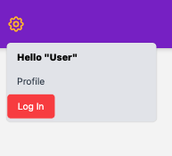
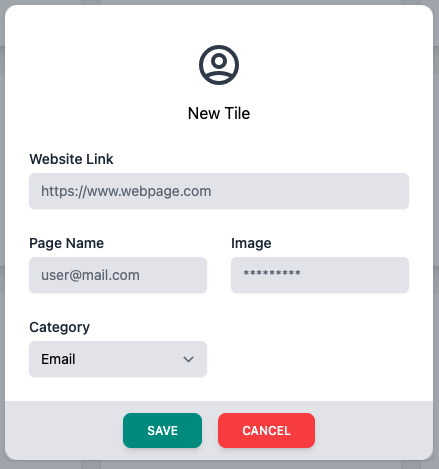
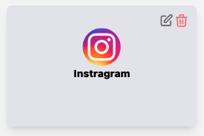
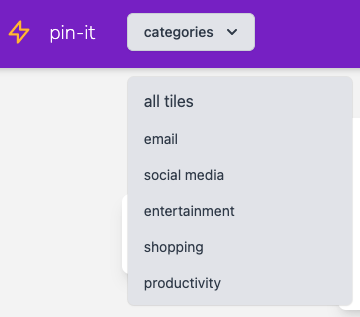
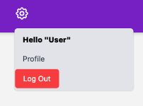
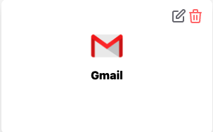
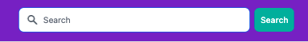
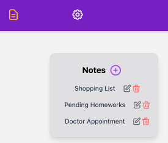

### [](https://opensource.org/licenses/MIT)
# Pin-it
Pin-it | Application designed to organize all the applications you use every day, having everything within your main internet access.

# Purpose
The purpose of this app is to improve the management and order of our applications, saving all our online websites in one site and divide them into categories, avoiding wastig time looking for them one by one and improving our experience within the browsers.

# Table of Contents

  - [MVP](#MVP)
  - [Pin-it-Deployed](#Pin-it-Deployed)
  - [Manual-user](#Manual-user)
  - [Frontend-code](#frontend-code)
  - [Futures-Implementations](#Futures-Implementations)
  - [License](#License)
  - [Contribution](#contribution)
  - [Backend-code](#Backend-code)
  - [Node.js](#Node)
  - [server.js](#server.js)
  - [Package.json](#Package.json)

# MVP
```md
As a user I want to be able to store the applications I usually use in a daily basis, 
so I can organize and get into my apps faster.
```
This app should cover all the following criteria:
```md
WHEN I get into my app.
THEN I am presented with a nav bar.
WHEN I look into the nav bar.
THEN I am presented with a search input, categories options and icons.
WHEN I click in the top-right icon.
THEN a log-in button is displayed.
WHEN I click on log-in button.
THEN I am presented in a new page, where I can create a new account or submit an account already created.
WHEN I log-in an account.
THEN I get in and a Log-out button appears by clicking at the top-right icon of the page.
WHEN I click in a new title.
THEN a modal card appears waiting for user to submit info required, such as website link, page name, image and category.
WHEN I click save in the modal card.
THEN a new card it´s added to the page.
WHEN I click in a card
THEN the website stored in that specific card it´s open in a new tab within the browser.
WHEN I click in categorie button in nav bar
THEN all categories are shown down.
WHEN I click in Log Out button which it´s inside of the top-right icon
THEN I get Log out from my account.

```
# Pin-it-Deployed
### This is how Pin-it looks like from the landing page.


### Here is how the log-in page looks like.



### You can create a new account in card below within log-in page.



### You can submit your username in card below within log-in page.


# Manual-User
### These are the instructions to follow as a user:

### 1. Visit the following URL: https://pin-it-app-project.herokuapp.com/
### 2. Create a new account for Pin-it by clicking at the top icon and then another click in log-in button.



### 3. If you have an account created already, please submit your email and password and then click in Log-In button.
   


### 4. IF you don´t have an account, please create one account filling empty fields below with a username, Email address and Password to finally click in Sign-Up button to log in.
  

 
### 5. Start adding your favorite online websites by clicking in new tile as below.
   

   
### 6. Once step 5 it´s completed, add a new website filling empty fields below (Webisite Link, Page Name, Image and Category) and the click in 'Save' button to add it and 'Cancel' to get back.



### 7. Click inside in one of the cards deployed and it will refer you to the website stored within the card. For Example:

#### 7.1 Click in Instagram card and then...



#### 7.2 Instagram website will be open in a new tab within your browser as you can see below.


### 8. Filter the websites added by categories, clicking on the category button showed in the nav bar and then click in a specific category you want to see within your screen.


   
### 9.  Finally, click in log out button inside the top-right icon to log out from Pin-it.
   


# Frontend-code

The app was built with help of the following technologies:

* 
* 	
* 
* 
* 
* 
* 
* 
* 
* Handlebars

# Futures-Implementations

* Implement the Google API to log in with a google account such a gmail.
* Make it possible to remove cards no longer needed by user on clicking in delete button. 
  
  

* Make search section in the nav bar look into an specific card .
  
  

* Make it possible to add notes, as well as shopping lists, to-dos and appointments.
  
  


# License

### MIT License (https://opensource.org/licenses/MIT)

      MIT License Copyright (c) [year] [fullname]
      
      Permission is hereby granted, free of charge, to any person obtaining a copy
      of this software and associated documentation files (the "Software"), to deal
      in the Software without restriction, including without limitation the rights
      to use, copy, modify, merge, publish, distribute, sublicense, and/or sell
      copies of the Software, and to permit persons to whom the Software is
      furnished to do so, subject to the following conditions:
      
      The above copyright notice and this permission notice shall be included in all
      copies or substantial portions of the Software.
      
      THE SOFTWARE IS PROVIDED "AS IS", WITHOUT WARRANTY OF ANY KIND, EXPRESS OR
      IMPLIED, INCLUDING BUT NOT LIMITED TO THE WARRANTIES OF MERCHANTABILITY,
      FITNESS FOR A PARTICULAR PURPOSE AND NONINFRINGEMENT. IN NO EVENT SHALL THE
      AUTHORS OR COPYRIGHT HOLDERS BE LIABLE FOR ANY CLAIM, DAMAGES OR OTHER
      LIABILITY, WHETHER IN AN ACTION OF CONTRACT, TORT OR OTHERWISE, ARISING FROM,
      OUT OF OR IN CONNECTION WITH THE SOFTWARE OR THE USE OR OTHER DEALINGS IN THE
      SOFTWARE.

# Contribution

* Adrian Strozzi
* Alejandro Bahena
* Diego Jimenez
* Erendira Mendoza
* Javier Fernandez
* Javier Resines
* Jorge Cardenas
* Mario Acosta
* Pablo Garcia

# Backend-code
This section describes the main FE features and how they work...

# Node.js
Node.js is a runtime environment for JavaScript that runs on the server.
Node.js advantage is that allows frontend developers that write JavaScript to run the server-side code and frontend-side code without the need to learn a completely different language.

# server.js 
const http = require('http')
const hostname = '127.0.0.1'const port = 3000
const server = http.createServer((req, res) => {  res.statusCode = 200  res.setHeader('Content-Type', 'text/plain')  res.end('Hello World\n')})
server.listen(port, hostname, () => {  console.log(`Server running at http://${hostname}:${port}/`)})

# Package.json file
A package.json file can be described as a manifest of your project that includes the packages and applications it depends on, information about its unique source control, and specific metadata like the project's name, description, and author.

# Node.js frameworks - Express
Es the most widely used Node.js server framework, and allows you to quickly and easily establish your API routes and associated HTTP request methods.

# Routing
Server design to handle responses when a client makes a request at a specific endpoint, or URL. In an earlier unit, you learned how to make GET requests from the client-side. Now, you will learn how those requests are handled on the server-side. Your server will listen for a specific type of request at a specific endpoint and when it hears that request, it will respond accordingly. 

# MySQL
A database is a collection of data stored electronically. The database management system (DBMS) we will be using in this unit is MySQL. MySQL is the most popular SQL database. The SQL in MySQL is short for Structured Query Language, and that structure is relational. A relational database stores and finds data based on its relationship to other data in the database. Relational databases are tabular, meaning data is stored in tables composed of rows and columns, much like a spreadsheet.

# Sequelize
Sequelize is a module that enables JS developers to work with relatuina data more easily. 
# Heroku

https://pin-it-app-project.herokuapp.com/

